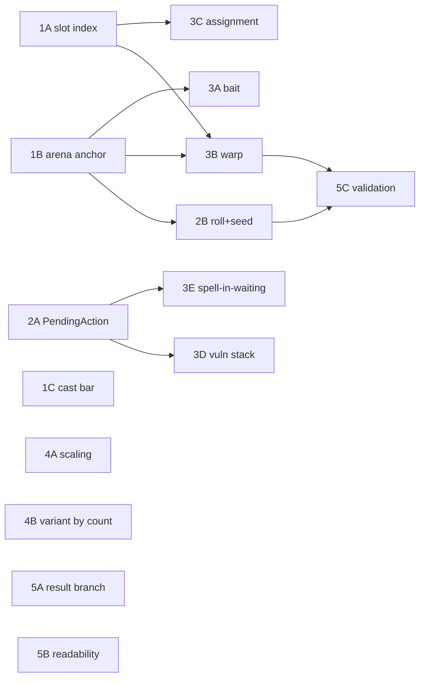

# Plan — Savage-grade Boss System

> Claude · 2026-07-31
> เป้าหมาย: ทำ encounter ที่ซับซ้อนระดับ FF14 savage (E12s P2 / P8S P1) ให้ได้ในเกม
> co-op roguelike 1–4 คน โดยไม่รื้อระบบเดิม
> อ้างอิงหลัก: **Rabbit & Steel** — เกมที่แก้โจทย์เดียวกันสำเร็จแล้ว (1–4 คน + roguelike + raid mechanics)

## หลักคิด

Savage ไม่ได้ยากเพราะ "AoE เยอะ" แต่ยากเพราะ **ผู้เล่นแต่ละคนถือ state ของตัวเอง
แล้วคลี่คลายคนละเวลา** และ **ตารางเวลาคงที่แต่คำตอบเปลี่ยนทุกรอบ**
ระบบเดิมเขียนได้แค่ "เวลา T ยิงท่านี้ใส่ทุกคน/สุ่มคน" — คอขวดคือ data model ไม่ใช่ UI

---

## ทำไปแล้ว (2026-07-31)

- [x] `BossTimelineAction` — timeline หลาย track, คลิป = `{action, startTime}` ยิงคู่ขนาน
      ([BossTimelineAction.cs](../Assets/Script/Data/BossTimelineAction.cs))
- [x] `BossAction.GetEditorDuration()` + override ในทุก action subclass (ใช้วาดความยาวคลิป)
- [x] **Boss Designer** — EditorWindow (UI Toolkit): encounter graph + timeline editor
      ([BossDesignerWindow.cs](../Assets/Editor/BossDesigner/BossDesignerWindow.cs) · [คู่มือ](boss_designer.md))
- [x] Knockback: `KnockbackMode` 5 แบบ + คิดเป็น **ระยะทาง** ไม่ใช่แรง + guard เวกเตอร์ศูนย์
      ([KnockbackMode.cs](../Assets/Script/Data/KnockbackMode.cs))

---

## ข้อตัดสินใจที่ล็อกแล้ว

| หัวข้อ | ตัดสินใจ | เหตุผล |
|---|---|---|
| Solo vs 4 คน | **สลับเป็น mechanic คนละตัว** ไม่ใช่ย่อสเกล | R&S พิสูจน์แล้ว · "tower 2 ต้นแต่มีคนเดียว" = แพ้ฟรี ไม่ใช่ยาก |
| คนเข้า/ออกกลางรัน | ปรับ HP **ลงได้ ขึ้นไม่ได้** | คนหลุด = ต้องเล่นจบได้ · คนเข้าปลายเกม = กัน exploit |
| ผลเมื่อพลาด | ติด **vulnerability stack** โดนดาเมจแรงขึ้นภายหลัง เฉพาะความยากสูง | ตามที่ผู้ใช้เลือก · ต้อง cap + decay กัน death spiral ในรัน 15 นาที |
| Gaze | **ตัดทิ้ง เปลี่ยนเป็น bait AoE** | ทิศที่ตัวละครหันมาจาก AutoNearest/MouseAim ที่ขัดกัน ผู้เล่นไม่ได้คุม |
| Knockback | **ไม่มีภูมิคุ้มกัน · ไม่มีตกขอบตาย** | ตามที่ผู้ใช้เลือก |
| Cast bar | วางติดกับ boss HP bar | ตามที่ผู้ใช้เลือก |
| การสุ่ม | **สุ่มพารามิเตอร์ ไม่สุ่มตารางเวลา** ผ่าน named roll + seed | ทำให้ fight เรียนรู้ได้แต่ท่องจำไม่ได้ |
| Debuff กับ Spell-in-Waiting | **primitive ตัวเดียวกัน** (`PendingAction`) | ทั้งคู่คือ "ของที่มี timer แล้วพอหมดเวลายิง action" ต่างแค่เจ้าของ |
| บอสสุ่มไหม | **ไม่** — mechanic ตายตัวต่อบอส ความแปรผันมาจาก roll + ลำดับด่าน + loot | R&S ทำแบบนี้ · อย่าเสียเวลาทำ procedural boss |
| ระดับความยาก | **5 tier: Easy · Normal · Hard · Savage · Epic** (Epic เกือบเป็น boss rush) | ตามที่ผู้ใช้เลือก |
| คลาสบอส | ใช้ `BossController` ตรงๆ บน prefab · `MainBoss`/`MiniBossAI` เป็น legacy ทิ้งได้ | ผู้ใช้ยืนยัน · บอสในฉากจริงใช้ `BossController` อยู่แล้ว |

---

## เฟสงาน

### Phase 1 — ฐาน (ปลดล็อกอย่างอื่นมากที่สุด)

- [ ] **1A · Player slot index 0–3** — server แจก slot ตอน join เป็นแหล่งความจริงเดียวของสีผู้เล่น
  - **แก้บั๊กที่มีอยู่จริง**: สีมาจาก `clientId % 4` ที่
    [ColorMatchAoEAction.cs:68](../Assets/Script/Data/ColorMatchAoEAction.cs:68),
    [:75](../Assets/Script/Data/ColorMatchAoEAction.cs:75),
    [TelegraphZone.cs:269](../Assets/Script/TelegraphZone.cs:269)
    แต่ NGO ไม่การันตีว่า clientId เป็น 0–3 — คนหลุดแล้วต่อใหม่ได้ id ใหม่
    เช่นเหลือ `{0, 2, 3, 4}` → สองคนได้สีแดง แล้ว color match พังเงียบๆ
  - โปรเจกต์นี้มี reconnect ในแผนอยู่แล้ว (ดู [plan-server-state-and-reconnect.md](plan-server-state-and-reconnect.md)) จึงเจอแน่
  - ใช้ต่อโดย: color match · assignment · warp ตามตำแหน่งประจำตัว · debuff HUD
  - ขนาด: **เล็ก**

- [ ] **1B · Arena anchor system** — `ArenaDefinition` (รูปร่าง, ศูนย์กลาง, cardinal / intercardinal / quadrant / clock spot)
  - targeting อ้าง**ชื่อจุด**แทนตัวเลขดิบ (`StaticCoords` ปัจจุบันใช้ไม่ได้จริงในการออกแบบ safe spot)
  - ใช้ต่อโดย: anchor roll · warp destination · bait drop zone
  - ขนาด: **กลาง**

- [ ] **1C · Cast bar** — `castName` + `castTime` บน `BossAction` → ClientRpc → `BossHUDUI`
  - **แยกจาก `actionDelay`**: `actionDelay` = หน่วงเงียบ · `castTime` = ช่วงที่ผู้เล่นเห็นและอ่านชื่อท่าได้
  - ใส่เป็นลูกของทั้ง panel MainBoss และ list MiniBoss ใน `BossHUDUI`
  - ชื่อท่าภาษาไทยต้องผูก Sarabun SDF
  - ขนาด: **เล็ก** · ไม่ติดใคร แทรกทำเมื่อไหร่ก็ได้

### Phase 2 — Primitive หลัก

- [ ] **2A · `PendingAction` / Status system**
  - `StatusEffectData` (SO): ชื่อ, ระยะเวลา, stack สูงสุด, decay, ไอคอน, `damageTakenMult`, **`onExpire → BossAction`**
  - รันไทม์: `NetworkList<StatusEntry>` (server เขียนอย่างเดียว) — เจ้าของเป็น **ผู้เล่น** (debuff) หรือ **การต่อสู้** (Spell-in-Waiting)
  - HUD: แถบ timer + จำนวน stack (ไม่เห็น = ตายแบบไม่รู้สาเหตุ)
  - **ปลดล็อก vocabulary savage ราว 60%** และเป็นสิ่งเดียวที่ fake ด้วยระบบเดิมไม่ได้เลย
  - Editor: **debuff swimlane ต่อผู้เล่น** ใน timeline (รูปแบบเดียวกับที่ raid guide วาด)
  - ขนาด: **ใหญ่**

- [ ] **2B · Roll system + deterministic seed**
  - **Named roll**: ค่าสุ่มมีชื่อ คลิปอ้างชื่อได้ → mechanic หลายจังหวะผูกกันเป็นเรื่องเดียว
    (เช่น safe quadrant ตอน 5s กับ 10s เป็นที่เดียวกัน) ถ้าไม่มีจะได้แค่ "ท่ามั่วที่ไม่สัมพันธ์กัน"
  - ประเภท: variant · anchor · มุมหมุน (snap) · เป้าหมาย · **mirror X/Z** (เพิ่มความหลากหลาย 2 เท่าฟรี) · สลับลำดับ
  - **Seed**: server สุ่มตอนเริ่ม fight ทุกค่างอกจาก seed → practice mode seed คงที่ + debug ได้
  - **Constraint**: `excludePrevious`, น้ำหนักต่อตัวเลือก, ห้ามทับกับ roll อื่น
  - **ต้องทำก่อนมี encounter เยอะ** — ตอนนี้คือเพิ่มฟิลด์ ทีหลังคือรื้อ asset ทั้งหมด
  - Editor: roll panel · ป้าย roll บนคลิป · ปุ่มเปลี่ยน seed แล้ว preview เปลี่ยนตาม
  - ขนาด: **กลาง–ใหญ่** · ต้องมี 1B ก่อนสำหรับ anchor roll

### Phase 3 — คลัง mechanic

- [ ] **3A · Bait AoE** (แทน gaze)
  - แยก stage: `baitDuration` (marker ตามตัว) → snapshot ตำแหน่ง → `warningDuration` → ระเบิด
    ปัจจุบัน `SpawnAoEActionBase` คำนวณตำแหน่งครั้งเดียวตอน spawn จึงไม่มีช่วง bait จริง
  - ต่อยอดจาก `isChasing` + `chaseLockInTime` ที่มีอยู่ (กลไกเดียวกัน ต่างแค่ความหมายและหน้าตา)
  - **ทิ้ง `FloorHazard` ไว้หลังระเบิด** → สนามหดลงเรื่อยๆ บังคับให้ทีมวางแผนว่าจะวางตรงไหน
  - บังคับระยะห่างขั้นต่ำเมื่อ bait หลายคนพร้อมกัน
  - ขนาด: **กลาง** · ไม่ติดใคร

- [ ] **3B · Forced warp**
  - **ห้ามทำตามแบบ knockback** ที่รันฝั่ง owner — warp ต้อง server set position จริง + ClientRpc snap
  - ต้องทำด้วย: ปลด lerp `FollowCamera` ชั่วคราว · ล็อก input ~0.2s · ยกเลิก dash/knockback ที่ค้าง · VFX ทั้งจุดออกและจุดเข้า
  - ทิศเป็น data: ตายตัวตาม slot (ต้องมี 1A) · สุ่มจาก anchor set · กระจายออกจากบอส · สลับที่กับเพื่อน
  - เข้าคู่กับ Spell-in-Waiting ได้ดี: warp ไปมุมหนึ่ง แล้วสเปลที่ค้างไว้ค่อยระเบิด
  - ขนาด: **กลาง** · ต้องมี 1A, 1B

- [ ] **3C · Assignment system** — targeting SO: เลือก N คน · ห้ามซ้ำรอบก่อน (จำ history) · กระจายบทบาท
  - แทน `TargetingMode` แบบ enum เดิมที่มีแค่ random/nearest/all
  - ขนาด: **กลาง** · ต้องมี 1A

- [ ] **3D · Vulnerability stack** — พลาด mechanic → ติด stack → โดนดาเมจแรงขึ้นภายหลัง
  - `TelegraphZone` เพิ่ม `onFailStatus` แทนการตีดาเมจดิบอย่างเดียว
  - `minDifficulty` gate — ความยากต่ำไม่ติดเลย
  - cap stack + decay **บังคับ** (รัน 15 นาที ไม่ใช่ pull ที่รีสตาร์ทฟรีแบบ FF14)
  - ขนาด: **เล็ก** · ต้องมี 2A

- [ ] **3E · Spell-in-Waiting** — cast ตอนนี้ resolve ทีหลัง หลายสเปลค้างพร้อมกันแล้วคลี่คลายสลับลำดับ
  - ใช้ `PendingAction` ตัวเดียวกับ 2A เจ้าของเป็นการต่อสู้แทนผู้เล่น
  - **Editor ต้องเปลี่ยนวิธีวาด**: คลิปไม่ใช่ก้อนต่อเนื่องอีกต่อไป ต้องเป็น
    ก้อน cast → เส้นประ → ก้อน resolve และมี track "resolutions" เรียงตามเวลา resolve
    ไม่งั้น timeline จะโกหก (เห็นท่าเรียงสวย แต่ของจริงไประเบิดพร้อมกันทีหลัง)
  - ขนาด: **กลาง** · ต้องมี 2A

### Phase 4 — ความยากและ scaling

- [ ] **4A · `DifficultyScalingConfig`** — 3 แกน: จำนวนคน × ความยาก × ด่าน
  - **กับดัก**: อย่าคูณทั้ง HP และจำนวน mob ด้วยแกนจำนวนคนแรงเท่ากัน ความยากจะโตแบบกำลังสอง
  - นโยบายคนเข้า/ออก: ล็อกตัวคูณตอนเริ่มรันเป็น baseline · คนออก → ลด HP ที่เหลือตามสัดส่วน · คนเข้า → ไม่เพิ่ม
  - ปัจจุบัน **ไม่มี gameplay scaling ตามจำนวนคนเลย** (จำนวนคนใช้แค่ analytics / lobby UI / spawn point)
  - ขนาด: **กลาง** · ไม่ติดใคร

- [ ] **4B · Variant by player count บน `BossAction`**
  - ตาราง `1p → ActionA · 2p → ActionB · 3–4p → ActionC` เป็นฟิลด์ในตัว action
  - solo = bullet hell · 3–4 คน = mechanic ที่ต้องประสานงาน
  - Editor: toggle บน toolbar เพื่อดูว่าโหมด 1/2/3/4 คนเห็นอะไร (ไม่งั้นออกแบบไม่ครบแล้วไม่รู้ตัว)
  - ขนาด: **กลาง**

### Phase 5 — วงจรป้อนกลับและความอ่านง่าย

- [ ] **5A · Mechanic result → branch** — `TelegraphZone` รายงานผล (soak ครบไหม / โดนกี่คน) → event bus → condition node ใน graph
  - นี่คือสิ่งที่ทำให้ "ทำพลาด → โดนลงโทษ" เป็นไปได้ ซึ่งเป็นหัวใจของ savage
  - ขนาด: **กลาง**

- [ ] **5B · Readability** — จุดอ่อนอันดับ 1 ของ R&S (รีวิวติดว่าจอรก เล่น 30+ ชม. ยังอ่าน indicator ไม่ทัน)
  - **รูปทรงกำกับคู่สี** (R&S ต้องเพิ่มทีหลังเพราะปัญหา colorblind)
  - **เสียงเตือนต่อ mechanic เป็น data** ไม่ใช่ฝากบน prefab อย่างเดียว (R&S จ้าง sound designer ทำเฉพาะเรื่องนี้)
  - ถ้าทำดีกว่าตั้งแต่ต้น = ข้อได้เปรียบจริง ไม่ใช่แค่ตามให้ทัน
  - ขนาด: **กลาง**

- [ ] **5C · Editor validation / lint**
  - **brute-force ทุก combination ของ roll** (4 quadrant × 2 mirror = 8 กรณี ไล่หมดได้สบาย)
    → "seed แบบ NE+mirror ไม่มีจุดปลอดภัยที่ t=12.4s"
    พอมีการสุ่มแล้ว **มองด้วยตาไม่ได้อีกต่อไป** ว่าปลอดภัยทุกกรณีไหม
  - warp ไปทับ AoE ที่กำลังจะระเบิด = ดาเมจหลบไม่ได้
  - นับ telegraph ที่ active พร้อมกัน ณ เวลา T → เตือนถ้าเกินเกณฑ์
  - mechanic 2 ตัวคลี่คลายห่างกันน้อยเกินไป
  - ขนาด: **กลาง**

---

## ลำดับพึ่งพา

**แทรกได้ทุกเมื่อ ไม่ติดใคร**: 1C · 3A · 4A · 5B

---

## ตัวเลขอ้างอิง (จาก Rabbit & Steel)

| รายการ | 1 คน | 2 คน | 3 คน | 4 คน |
|---|---|---|---|---|
| HP บอส (R&S ยืนยัน 1–3) | 100% | 180% | 240% | ~290% |
| จำนวน mob ต่อ wave (เสนอ) | 100% | 150% | 190% | 220% |

เหตุผลที่ sublinear: คนที่ 2, 3, 4 แต่ละคนออกแรงน้อยลง → กลุ่มใหญ่ยังคุ้มกว่าโดยไม่ลงโทษกลุ่มเล็ก

---

## หลักการออกแบบที่ยืมมา

- **บอสทุกตัวต้องมีอย่างน้อย 1 อย่างที่มีแค่มันทำได้** (mino_dev, 46 encounter)
  → ต้องทำให้ *สร้าง* `BossAction` ใหม่ถูกและเร็ว มากกว่าพยายามทำ action ตัวเดียวให้ generic ครอบจักรวาล
  → ควรมี skill `create-boss-action` เพิ่มจาก `create-enemy` ที่มีอยู่
- **จัดธีม mechanic ตามโซน** ให้ผู้เล่นสะสม vocabulary (R&S: นก = teleport/จำ pattern · หมาป่า = knockback/จำกัดพื้นที่ · กบ = หยุดนิ่ง/จับคู่สี)
- **พลาด = state ที่อ่านออก** ไม่ใช่เลือดลดนิดหน่อยที่แยกไม่ออกว่าพลาดหรือโดนอย่างอื่น

---

## ระดับความยาก (5 tier)

| Tier | บทบาท | ผลต่อระบบ |
|---|---|---|
| Easy | เรียนรู้ pattern | ไม่ติด vulnerability stack · mechanic variant ง่ายสุด |
| Normal | มาตรฐาน | ไม่ติด vulnerability stack |
| Hard | เริ่มลงโทษ | **เริ่มติด vulnerability stack** · enrage สั้นลง |
| Savage | เป้าหมายของแผนนี้ | mechanic ครบชุด · ซ้อนหลายชั้น · roll เยอะขึ้น |
| Epic | เกือบเป็น boss rush | บอสต่อเนื่อง · พักน้อย · ใช้ `DifficultyScalingConfig` แกนความยากสูงสุด |

`minDifficulty` ใน 3D และแกนความยากใน 4A อ้าง enum ตัวนี้ — ต้องนิยาม `DifficultyTier` ก่อนเริ่มสองงานนั้น

---

## งานล้าง legacy (แยกจาก 5 เฟส)

ผู้ใช้ยืนยันว่า `MainBoss` / `MiniBossAI` ทิ้งได้ — ตรวจแล้วสถานะจริงเป็นแบบนี้:

- [x] **`MiniBossAI.cs` ลบแล้ว** — ไม่มี prefab ไหนอ้าง (grep GUID ในทุก `.prefab`/`.unity` = 0)
      และไม่มีโค้ดไหนใช้ (มีแต่คอมเมนต์) · event `OnAnyMiniBossSpawned/Defeated` ไม่มีใคร subscribe
- [x] **`MiniBossConfig` เหลือเป็น alias เปล่า** — ฟิลด์ legacy `actions` + `OnValidate()` ลบแล้ว
      (asset ทั้ง 2 ตัวมี `actions: []` และ `phases` เต็มอยู่แล้ว)
- [x] **`MainBoss.cs` ลบแล้ว** (2026-07-31) — ลำดับที่ทำ:
      1. ผู้ใช้ลบ Red.prefab ใน Editor (prefab เดียวที่ใช้ `MainBoss` และไม่อยู่ในฉากไหน)
      2. เคลียร์ entry ค้างใน `DefaultNetworkPrefabs.asset` (Unity ไม่ลบให้อัตโนมัติ)
      3. ย้าย phase announcement เป็น data: `BossPhase` ได้ฟิลด์ `announcementText` /
         `announcementColor` / `phaseVfxName` (`[VFXKey]` dropdown) → `BossController.OnPhaseChangedClient` เล่นให้
      4. migrate ค่า legacy ลง `BossConfig_01.asset` (config จริงของ BossRed):
         เฟส 2 = "PHASE 2 — ENRAGE" ส้ม · เฟส 3 = "PHASE 3 — FINAL FORM" แดง · VFX `PhaseShockwave` ทั้งคู่
      5. ลบ `MainBoss.cs` + meta — ไม่เหลือการอ้าง type ในโค้ด
      - หมายเหตุ: BossRed (main boss ในฉาก) ใช้ `BossConfig_01.asset` ที่เฟส 2/3 เป็น
        `BossTimelineAction` sub-asset จาก Boss Designer อยู่แล้ว — ระบบใหม่ใช้งานจริงแล้ว

### ค่า designer จาก Red.prefab (ลบไปแล้ว — ตารางนี้คือบันทึกเดียวที่เหลือ)

Red.prefab เคยเก็บค่าที่ designer ตั้งไว้ซึ่งหลุดจากโค้ดไปตั้งแต่ refactor รอบก่อน
ถ้าจะจูน `BossConfig_01` ให้เหมือนบอสยุคแรก ใช้เลขคอลัมน์ซ้าย:

| คีย์ใน prefab | ค่าที่ designer ตั้งไว้ | ค่าที่ใช้จริงตอนนี้ |
|---|---|---|
| `phase2Threshold` | 0.6 | 0.75 (`legacyPhase2Threshold` default) |
| `phase3Threshold` | 0.3 | 0.30 (บังเอิญตรง) |
| `phase1/2/3Interval` | 4 / 3 / 2 | 2.5 ทุกเฟส (hardcode ใน `GenerateLegacyConfig`) |
| `phaseTransitionDuration` | 1.5 | 1.5 / 1.5 / 2.0 (hardcode) |
| `phaseShakeMagnitude` | 0.4 | 0.4 / 0.5 / 0.6 (hardcode) |

ค่าท่าโจมตี (`circleRadius`, `lineLength`, tether ฯลฯ) ยังตรงกับฟิลด์ปัจจุบัน ไม่หาย
→ ตอนสร้าง `BossEncounterConfig` asset ตัวจริงมาแทน ให้ใช้ **ค่าที่ designer ตั้งไว้** ในตารางซ้าย ไม่ใช่ค่าที่โค้ดใช้อยู่

---

## คำถามที่ยังเปิดอยู่

1. **Arena** ยังไม่มีคำนิยามรูปร่าง/ขอบเขต — 1B ต้องรู้ก่อนว่าสนามจริงหน้าตายังไง (กลม? สี่เหลี่ยม? มีเสา?)
   เป็นตัวบล็อก 2B (anchor roll) · 3A (bait drop zone) · 3B (warp destination)
2. **Knockback authority** — รันฝั่ง owner ทำให้ server ไม่รู้ตำแหน่งปลายทางทันที
   ถ้าจะทำ mechanic "ต้องถูกผลักเข้าโซนที่ถูกต้อง" ต้องให้ server ตัดสินจากตำแหน่งหลัง settle
